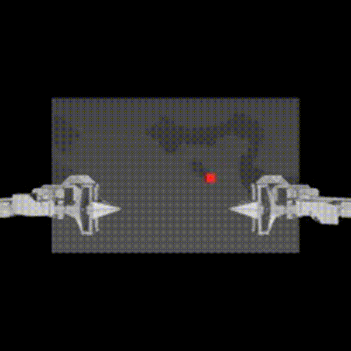

# Robotics
### [example workflow for running p0 inference on Aloha simulation]


### Edit Dockerfiles
```bash
git clone https://github.com/Physical-Intelligence/openpi.git
```
Edit `examples/aloha_sim/Dockerfile`
```dockerfile
...
# Set working directory
WORKDIR /app
+
+ # Copy project files into the container
+ COPY . /app
+
+ # Ensure permissions (optional, needed if files are not accessible)
+ RUN chmod -R 777 /app
+
# Copy requirements to install dependencies
COPY ./examples/aloha_sim/requirements.txt /tmp/requirements.txt
COPY ./packages/openpi-client/pyproject.toml /tmp/openpi-client/pyproject.toml
...
```
and `scripts/docker/serve_policy.Dockerfile`:
```dockerfile
...
WORKDIR /app
+
+ # Copy project files into the container
+ COPY . /app

+ # Ensure permissions (optional, needed if files are not accessible)
+ RUN chmod -R 777 /app
+
# Needed because LeRobot uses git-lfs.
RUN apt-get update && apt-get install -y git git-lfs
...
```
### Build images locally
```bash
cd examples/aloha_sim/
docker compose build 
```

### Retag for ghcr
Follow [this](https://github.com/AntreasAntoniou/useful-commands/blob/main/docker.md) first in order to login to `ghcr`.
```bash
docker tag openpi_server ghcr.io/YOUR_GIT_USERNAME/openpi_server:latest
docker tag aloha_sim ghcr.io/YOUR_GIT_USERNAME/aloha_sim:latest
```

### Push built images to ghcr

```bash
docker push ghcr.io/YOUR_GIT_USERNAME/aloha_sim:latest
docker push ghcr.io/YOUR_GIT_USERNAME/openpi_server:latest
```

### Kubernetes

Once you are able to login to EIDF cluster, create a `ghcr secret`:

```bash
kubectl create secret docker-registry ghcr-secret --docker-server=ghcr.io \
                                                  --docker-username=YOUR_GIT_USERNAME \ 
                                                  --docker-password=YOUR_GIT_PAT \
                                                  --docker-email=YOUR_GIT_EMAIL

```
then you can use the `*-pvc.yaml`s in this repo to create the required PVCs and then start the jobs:
```bash
git clone https://github.com/dgen/robotics.git
cd robotics
kubectl apply -f data-pvc.yaml
kubectl apply -f openpi-data-pvc.yaml
kubectl apply -f aloha-sim.yaml
kubectl apply -f openpi-server.yaml
```

This should run a single episode of `gym_aloha/AlohaTransferCube-v0` and the result should be under
`/app/data/aloha_sim/videos`. Should look like the one above.